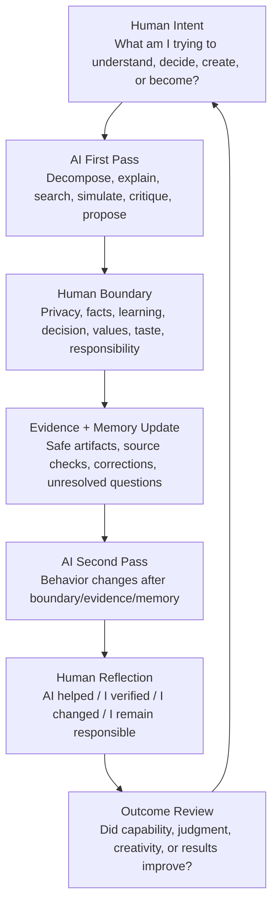
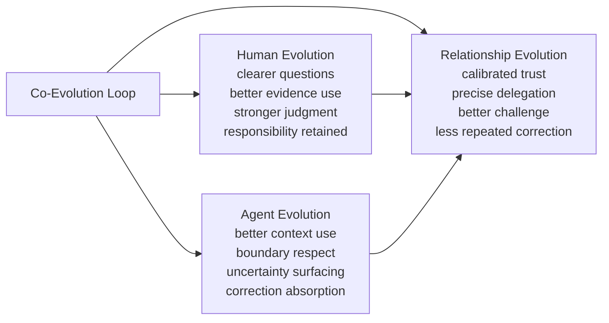
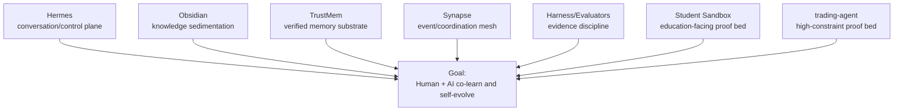
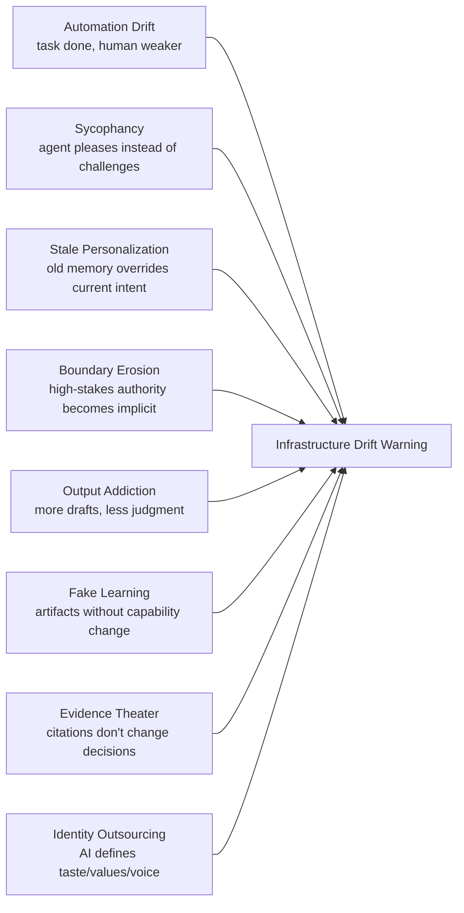

# Human-AI Co-Evolution Framework Diagram

This is the visual framework for the NOUS OS human-AI co-evolution theory track.

It should be used in public narrative, Student Sandbox explanations, architecture discussions, and future demo design to keep the project anchored on the human-AI growth loop rather than infrastructure.

## Core loop



## Three growth channels



## Infrastructure as experimental apparatus



Read the arrows as support, not ownership. The infrastructure does not define the goal; the goal defines which infrastructure is worth keeping.

## Boundary ring

The co-evolution loop is safe only if it runs inside a boundary ring:

```text
privacy
  facts
    learning
      decision
        values
          taste / identity
            responsibility
```

These boundaries are not friction to remove. They are part of the symbiosis design.

## Failure-mode map



## Proof-bed mapping

| Theory question | Student Sandbox proof bed | trading-agent proof bed |
|---|---|---|
| Can the human stay agentic? | student states intent, boundary, responsibility | operator preserves capital authority |
| Can AI help without replacing thinking? | hints/checklists, not final answers | research/risk support, not broker authority |
| Can memory improve the next cycle? | next prompt/source habit improves | reviewed outcomes update future reasoning |
| Can trust become calibrated? | student checks sources before belief | evidence-linked decisions and no-action logs |
| Can relationship compound? | student explains collaboration pattern | repeated corrections decrease over reviews |

## Design checkpoint

Before adding a NOUS OS feature, place it on this diagram.

Ask:

1. Which stage of the loop does it strengthen?
2. Which growth channel does it improve: human, agent, or relationship?
3. Which boundary does it preserve?
4. What evidence would show it worked?
5. What failure mode could it create?

If the answer is only `it makes the system more automated`, it is probably not core NOUS OS work.
